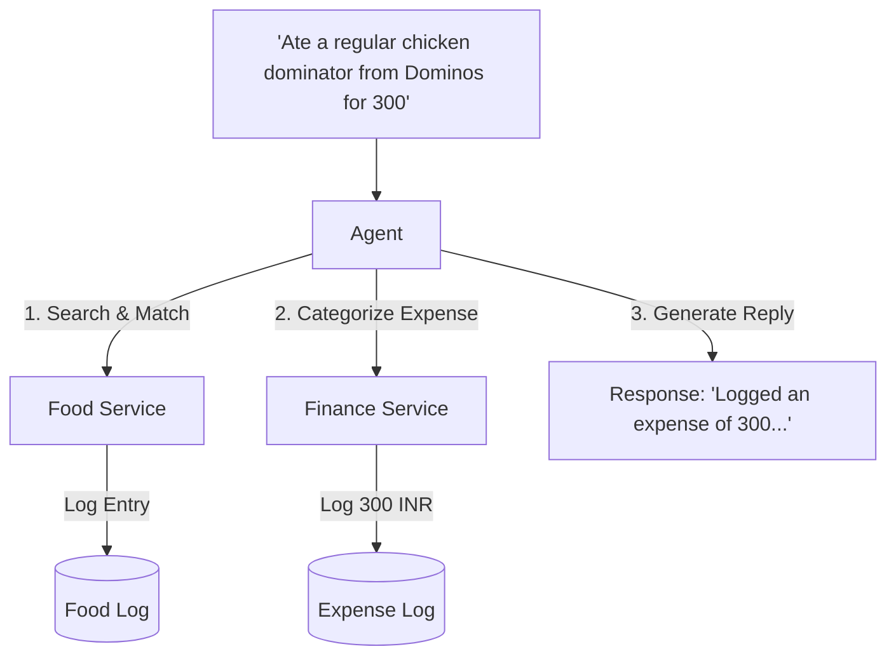
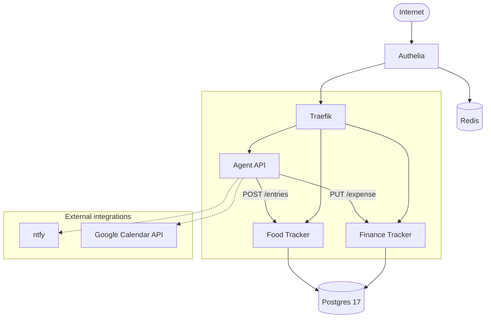

Last year I set out to build an agent that I could use in my life. Now, it helps me with managing my finances and food (1500+ logs so far!)

# Back in June 2025

Almost exactly an year ago, I saw [Karpathy's post](https://x.com/karpathy/status/1938626382248149433) on an LLM "cognitive core" (snippet):

> - Aggressively tool-using.
> - On-device finetuning LoRA slots for test-time training, personalization and customization.
> - Delegates and double checks just the right parts with the oracles in the cloud if internet is available.
>
> It doesn't know that William the Conqueror's reign ended in September 9 1087, but it vaguely recognizes the name and can look up the date. It can't recite the SHA-256 of empty string as e3b0c442..., but it can calculate it quickly should you really want it.

This felt obvious. We've achieved some parts, while some remain non trivial (finetuning and personalisation). Yet, seeing it spelt out made me think - how far have we gotten? What can I actually do with it for myself? So, I decided to set across to actually integrate "AI" in my life.

## _Where_ can agents even help?

There is all this "agentic" hype. But for me, this is the most natural question to ask &mdash; "_Where_ can agents even help?" My answer: they must meet the following criteria.

1. **The task should be meaningful.** You should not be able to automate this with deterministic code. It should require _some_ intelligence to execute. An agent for simply searching the web is not a game changer.
2. **It should be repetitive enough to benefit from automation.** You don't want to spend 2 hours to setup an agent that saves 10 minutes every month. It needs to increase accessibility, reduce time, or both.

## What capabilities are required?

The most common issue with an agent is fear of hallucination, doing irreversible actions, and being inconsistent. Many can be solved with the right tool permissions. But, what should the agent gaurantee?

1. **The quality should be consistent and reasonably high.** Low quality output is obviously bad. But so are agents that are inconsistent &mdash; delegating work that you need to double check is not very useful.
2. **It should be cheap and fast.** AI costs money. For an agent to be feasible, it should be cheaper than the next best option for the task.
3. **Privacy.** For most workloads, I do not want my data being sent to anyone. I should be able to run it locally, or with Zero Data Retention (ZDR).
4. **Long context.** Most uses largely benefit from long context windows. Good news is that most models now natively support decently long contexts.

These are competing objectives. A decently complex task requires a good quality model, which is often expensive and slower. Local models are often worse, or require expensive GPUs to run. This is changing, but we are yet to see models which have that density of intelligence.

## What I wanted to use agents for

### Task 1: Expense Logging

The one thing I've always wanted is a good breakdown of where I've spent money. My categories, my metrics. I tried logging manually for a few months, but wasn't able to be consistent enough. Eventually, I'd settled for total monthly expenditure.

The issue with me was accessibility. To track my daily expenses, I either have to:

- **Log it as soon as I pay.** Ideally the best, but I could not get myself to open an app and log an expense every time I pay.
- **Log it daily / weekly.** Easier to execute, but I need to remember where all I did spend. Cash payments and recalling where I spent money from logs hard to remember.

The solution? Once I've defined my categories, I want to talk to my agent to log the expense.

### Task 2: Food Logging

Similar to expenses, I've always wanted to track my macros. Could I talk to my agent, tell it what I ate, and it automatically finds the closest named food, understands units, etc, to log it for me?

### Task 3: Calendar Scheduling

This is the more standard and common use case. If I have many items I want to schedule, can my agent automatically push around other events for me? Keep the ones that are important fixed, and adjust the rest of my day accordingly?

# Now, in June 2026

Over the last year, I've been constantly playing around with this agent. Trying out different harnesses, STT options, improving accessibility, speed, optimising token usage, etc.

Not surprised to say - it has become a part of my daily life, and almost everyone who's been with me enough has seen me use it sometime or the other.

## What I have

As I had thought, the biggest delta was having an agent I could talk to.

My workflow is simple:

1. Click an iOS shortcut on my home screen, and speak out what I want.
2. Put my phone away.
3. A notification from ntfy follows shortly, telling me what was done.

I track food, water, expenses, income, investments, calendar events. All from a single click. Here's an example:

If you are interested in the agent architecture, you can find a more detailed writeup at the end.

Here is a video of me using it:

<NoteVideo
  src="./personal_agent_demo.mp4"
  title="Agent voice logging demo"
  className="md:max-h-[500px]"
/>

## What worked, and what didn't

I tried out many things as my agent evolved. Here is what worked and what didn't.

### 1. MCP is bullshit.

Token consumption is too high, a larger model is needed, and more bloatware (MCP servers) enter your stack. Simple, lean tools make models _much_ more capable.

### 2. The harness is as important as the model.

When I started off, I was under the opinion that a decent model can work with any decent harness. Boy was I wrong.

The first version had a single large system prompt, with MCP servers for each service. I saw myself needing relatively large models to get this to work, even though the task itself seemed to simple.

The current setup uses a router agent that delegates tasks to subagents for finance, expenses, etc. It is far more efficient than expecting a single agent to do everything.

For reference: the earlier setup required intelligence $\simeq$ Gemini 3.0 Flash for consistently high performance. The new harness works with Gemma 4 12B unified.

## Where we stand

Smarter and smaller models come out every month. Qwen and Gemma are two serious contenders. However, the ones that fit on consumer devices right now (no, a macbook pro does not count) still cannot do these reliably.

With models now natively supporting tool calling, developments in harnesses, and efforts in packing more intelligence per weight, we are closer to the world Karpathy described. Still, we are a few years away from true, edge models that run on already-existing hardware, which are capable of delegating tasks to.

# The agent architecture

For those who are interested in the technical details. I've only thought of this for personal use, so all choices are made with that in mind.

### Infra

I self-host all of this on a laptop I have back home &mdash; a 6 year old Lenovo Legion 5 (back when they were cheap).

The code lives in a monorepo, and every service is orchestrated through docker compose. I use nginx as a reverse proxy. Other than nginx, all services are contained within the repo.

Docker gives me good-enough logging, and auto-restarts for any issues that may arise.

### The services

The services are independent FastAPI REST API. They each also have dashboards to accompany them in NextJS (I'm currently working on making a unified frontend). All of them share the same postgres database. The database is backed up in scheduled intervals with [restic](https://restic.net/) and `pgdump`.

These themselves have no authentication. I use docker to add [Authelia](https://www.authelia.com/) as a (second) reverse proxy for authentication.

Lastly, I have a FastAPI REST server that wraps around the Agent. I run whisper locally for STT, which seems to work surprisngly well &mdash; even better than Sarvam!

### The agent

These services act as oracles. I use a custom harness built with [PydanticAI](https://pydantic.dev/pydantic-ai) (I was quite surprised to see Pydantic have an AI library). I've optimised tool calling to be as efficient as possible for my tasks. If you'd like to know more, hit me up on [X](https://x.com/dhrumangupta) or [email](mailto:dhrumangupta06@gmail.com), and I'll be happy to chat!

Here's a short diagram:

By all means, this is a simple piece of software. This could have probably been done 3 years ago as well. Then, it would require advanced NLP methods to (maybe?) get the accuracy this has. Now, it requires a GPU with 24GB VRAM or an API key.

From trying to automating Hypixel farms and writing obsecure code to automatically join classes in covid, there's something about automating things in my life, that makes my inner nerd happy.
